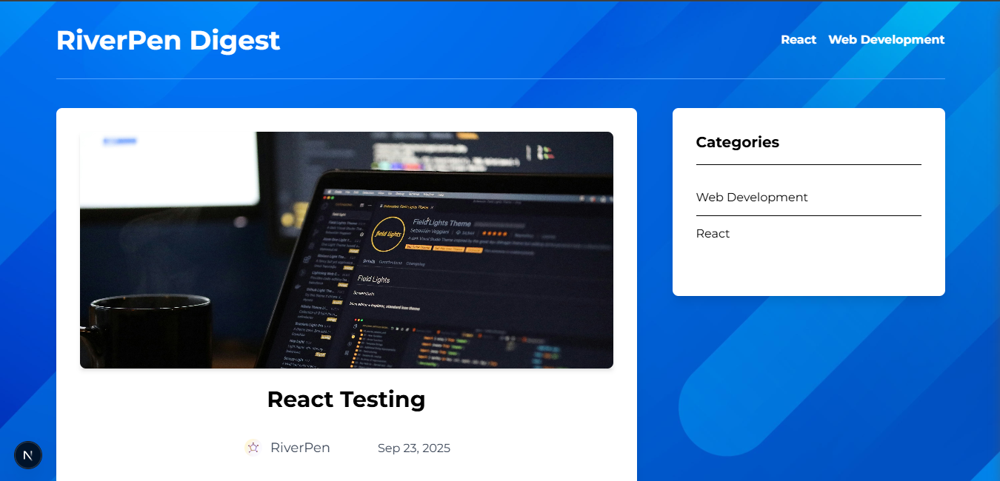

#  RiverPen Blog

A modern, full-stack blog platform built with Next.js and powered by GraphCMS (Hygraph). Features a beautiful gradient design, comprehensive error handling, and seamless content management.



##  Features

- 📝 **Rich Content Management** - Powered by GraphCMS/Hygraph
- 🎨 **Beautiful UI** - Modern gradient design with Tailwind CSS
- 📱 **Responsive Design** - Perfect on all devices
- 🔍 **SEO Optimized** - Built-in Next.js SEO features
- 💬 **Comment System** - Interactive user engagement
- 🏷️ **Category Filtering** - Organized content discovery
- 📊 **Adjacent Posts** - Enhanced navigation
- 🎠 **Featured Posts Carousel** - Highlighted content
- 🛡️ **Bulletproof Error Handling** - Never crashes, always graceful
- ⚡ **Server-Side Rendering** - Fast initial page loads
- 🎯 **TypeScript** - Type-safe development

## 🚀 Technologies

### Frontend


### Backend & CMS


### Development Tools


## 🏗️ Architecture

- **Frontend**: Next.js 15.5.3 with App Router
- **Styling**: Tailwind CSS with custom gradient themes
- **CMS**: GraphCMS (Hygraph) for content management
- **API**: GraphQL with comprehensive error handling
- **Deployment**: Optimized for Vercel deployment

## 📦 Installation

1. **Clone the repository**
   ```bash
   git clone https://github.com/Washington-NKE/riverpen-blog.git
   cd riverpen-blog
   ```

2. **Install dependencies**
   ```bash
   npm install
   ```

3. **Environment Setup**
   
   Create a `.env.local` file in the root directory:
   ```env
   NEXT_PUBLIC_GRAPHCMS_ENDPOINT=your_graphcms_endpoint
   GRAPHCMS_TOKEN=your_graphcms_token
   ```

4. **Run the development server**
   ```bash
   npm run dev
   # or
   yarn dev
   # or
   pnpm dev
   # or
   bun dev
   ```

5. **Open your browser**
   
   Navigate to [http://localhost:3000](http://localhost:3000)

## 🎨 Key Components

### Pages
- **Home Page** - Featured posts carousel and recent posts grid
- **Post Detail** - Full post content with rich text rendering
- **Category Pages** - Filtered posts by category
- **Author Information** - Author bio and photo display

### Features
- **Comments System** - Real-time comment submission and display
- **Error Boundaries** - React error boundaries for graceful error handling
- **Loading States** - Smooth loading transitions
- **Responsive Images** - Next.js Image optimization
- **SEO Meta Tags** - Dynamic meta tags for better SEO

## 🔧 Configuration

### GraphCMS Setup
1. Create models for Posts, Authors, Categories, and Comments
2. Set up relationships between models
3. Configure API permissions for read/write operations
4. Generate API tokens with appropriate permissions

### Styling Customization
The blog uses a purple-to-pink gradient theme. Colors can be customized in:
- Tailwind CSS classes: `from-[#cd19ff] to-[#e000ac]`
- Component styling throughout the application

## 🛡️ Error Handling

The blog features comprehensive error handling:
- **Network failures** - Graceful fallbacks for API issues
- **Component errors** - React Error Boundaries catch and display friendly messages
- **Loading states** - Clear feedback during data fetching
- **Empty states** - Helpful messages when no content is available

## 📱 Responsive Design

- **Mobile-first** approach
- **Breakpoint optimization** for tablets and desktops
- **Touch-friendly** interactions
- **Optimized images** for different screen sizes

## 🚀 Deploy on Vercel

The easiest way to deploy your Next.js app is to use the [Vercel Platform](https://vercel.com/new?utm_medium=default-template&filter=next.js&utm_source=create-next-app&utm_campaign=create-next-app-readme) from the creators of Next.js.

Check out our [Next.js deployment documentation](https://nextjs.org/docs/app/building-your-application/deploying) for more details.

## 📄 License

This project is licensed under the MIT License.

## 🤝 Contributing

Contributions are welcome! Please feel free to submit a Pull Request.

## 📧 Contact

**Author**: Washington Mwangi  
**Email**: washiem2022@gmail.com  
**Website**: [RiverPen Digest](https://blog.riverpen.com)

---

<div align="center">
  <strong>Why Not You?</strong>
</div>
